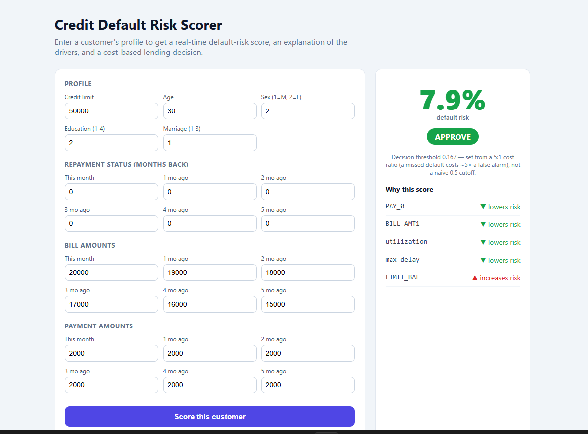

# Credit Default Risk Scorer — Full-Stack ML App

**🔗 [Live App](https://credit-risk-scorer-psi.vercel.app/)** · **[GitHub](https://github.com/grgarnv/credit-risk-scorer)**

A full-stack application that scores credit-card customers for **default risk** in
real time, explains *why* each customer is flagged, and recommends a lending
decision based on business cost — not a naive threshold.

**Stack:** React (Vite) · FastAPI · scikit-learn · SHAP · deployed on Vercel + Render.



## What it does

- **Real-time scoring** — enter a customer's 23-field profile, get a default-risk %.
- **Explainability** — SHAP values surface the top factors driving *that* customer's
  score (e.g. "3 months of late payments increases risk"), so a decision can be justified.
- **Cost-sensitive decisions** — the approve / review / decline threshold is derived from
  a 5:1 cost ratio (a missed default costs ~5× a false alarm), not a default 0.5 cutoff.
- **Model** — Gradient Boosting on the UCI *Default of Credit Card Clients* dataset
  (30,000 customers), with 4 domain-engineered features. Test ROC-AUC ≈ 0.78.

## Architecture

```
React (Vite) frontend  ──HTTP──▶  FastAPI backend  ──▶  GradientBoosting model + SHAP
   form + results panel            /predict endpoint       trained once at startup
```

## Run locally

**Backend**
```bash
cd backend
pip install -r requirements.txt
python train_model.py          # trains + saves model.joblib (needs internet for UCI)
uvicorn main:app --reload      # serves on http://localhost:8000
```

**Frontend**
```bash
cd frontend
npm install
npm run dev                    # serves on http://localhost:5173
```

## Deploy (free tiers)

- **Backend → Render:** connect the repo, it reads `render.yaml`. Trains the model on build.
- **Frontend → Vercel:** import the `frontend` folder, set env var `VITE_API_URL` to your
  Render backend URL.

## What I'd add next
- Probability calibration so scores read as true default probabilities
- Batch scoring (upload a CSV of customers)
- Auth + a saved decision log
